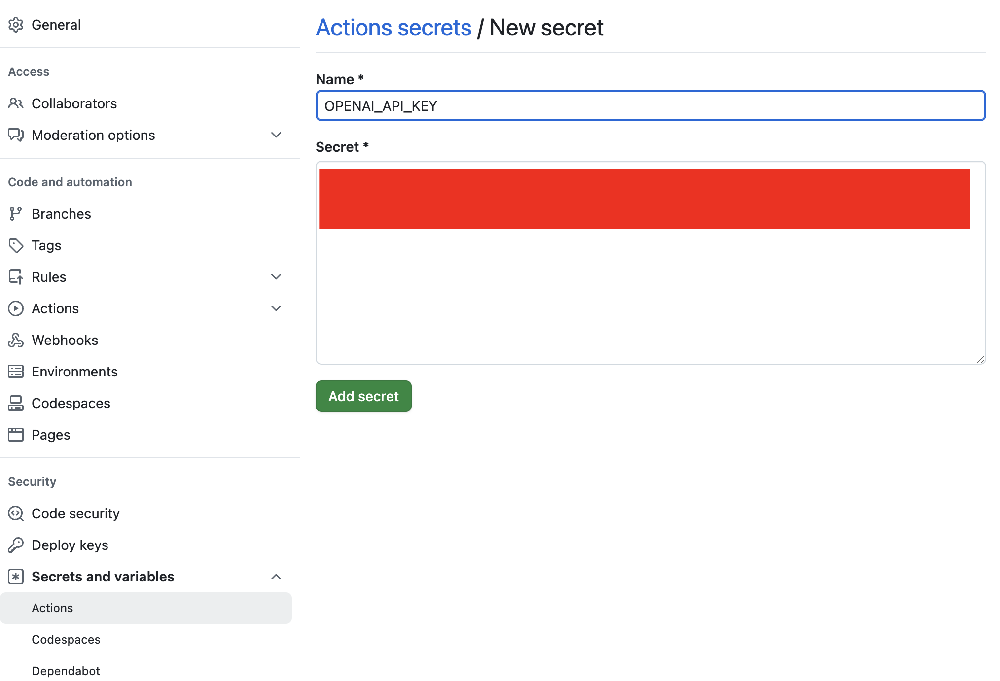

# terminal-ai-action

GitHub action to run AI commands as part of pipelines.

<!-- vim-markdown-toc GFM -->

- [Example Usage](#example-usage)
- [Documentation](#documentation)
    - [Setting the API Key](#setting-the-api-key)
- [TODO](#todo)

<!-- vim-markdown-toc -->

## Example Usage

Create a workflow, e.g. `.github/workflows/review.yaml`

```yaml
name: Review PR
on:
  pull_request:

jobs:
  review:
    steps:
      - name: Review with Terminal AI
        uses: dwmkerr/terminal-ai-action@latest
        with:
          openAiKey: ${{ secrets.OPENAI_API_KEY }}
          command: ai "review this PR"
```

The following configuration is supported:

| Configuration | Description                   |
|---------------|-------------------------------|
| `openAiKey`   | **Required.** OpenAI API Key. |
| `command`     | **Required.** An AI command. See [Examples](https://github.com/dwmkerr/terminal-ai?tab=readme-ov-file#examples)

## Documentation

### Setting the API Key

[Terminal AI](https://github.com/dwmkerr/terminal-ai) requires that an OpenAI API Key is set. You can create a key by following the guide at [OpenAI Platform - API Keys](https://platform.openai.com/api-keys). Once you have a key it is recommended to store it in an Action Secret:



Once you have created the secret you can pass it to the `terminal-ai-action` like so:

```yaml
jobs:
  review:
    steps:
      - name: Review with Terminal AI
        uses: dwmkerr/terminal-ai-action@latest
        with:
          openAiKey: ${{ secrets.OPENAI_API_KEY }}
          command: ai "review this PR"
```

## TODO

Quick and dirty task list:

- [ ] docs: nice example of [great README page](https://github.com/JamesIves/github-pages-deploy-action)
