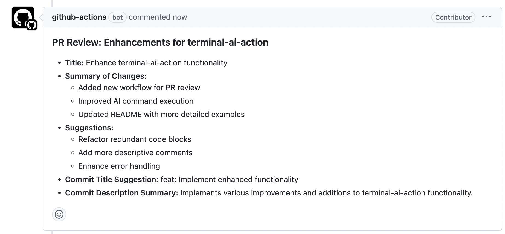

# terminal-ai-action

GitHub action to run AI commands as part of pipelines. Review code, comment on pull requests, open pull requests to add tests and more.

**Caution**: be mindful of costs given how many calls to APIs automated reviews can make, as well as how many tokens may be needed.

<!-- vim-markdown-toc GFM -->

- [Quickstart](#quickstart)
- [Configuration](#configuration)
    - [Setting the API Key](#setting-the-api-key)
- [Examples](#examples)
- [Helper Functions](#helper-functions)
- [TODO](#todo)

<!-- vim-markdown-toc -->

## Quickstart

To use the `terminal-ai-action`:

- Create a workflow, e.g. `.github/workflows/review.yaml`
- Set an `openAiApiKey`, which will let you call the [`ai`](https://github.com/terminal-ai) CLI
- Pass your prompts to `ai`, use optional [Helper Functions](#helper-functions) like `ai_pr_diff` to easily get diffs / logs / etc
- Put results into comments, open pull requests and so on

```yaml
name: Review PR
on:
  pull_request:

jobs:
  review:
    steps:
      - uses: actions/checkout@v4
        with:
          fetch-depth: 0 # get the full history.
    
      # Review the code. Examples in this repo show how to comment etc.
      - uses: dwmkerr/terminal-ai-action@latest
        with:
          openAiApiKey: ${{ secrets.OPENAI_API_KEY }}
          command: ai "review this PR" < ai_pr_diff
```

## Configuration

The following configuration is supported:

| Configuration | Description                   |
|---------------|-------------------------------|
| `openAiApiKey`   | **Required.** OpenAI API Key. |
| `command`     | **Required.** The command to run. See [Examples](https://github.com/dwmkerr/terminal-ai?tab=readme-ov-file#examples)

### Setting the API Key

[Terminal AI](https://github.com/dwmkerr/terminal-ai) requires that an OpenAI API Key is set. You can create a key by following the guide at [OpenAI Platform - API Keys](https://platform.openai.com/api-keys). Once you have a key it is recommended to store it in an Action Secret:


Once you have created the secret you can pass it to the `terminal-ai-action` like so:

```yaml
jobs:
  review:
    steps:
      - name: Review with Terminal AI
        uses: dwmkerr/terminal-ai-action@latest
        with:
          openAiApiKey: ${{ secrets.OPENAI_API_KEY }}
          command: ai "review this PR"
```

## Examples

[Review the changes in a pull request, suggest improvements, suggest a title and description](./.gihub/workflows/example-pr-summary.yaml)

[](./.gihub/workflows/example-pr-summary.yaml)

## Helper Functions

Some scripts are available to run as part of the `command` to conveniently work with the code. They are linked into the `bin` folder so can be called directly, e.g:

```bash
# Get the diff of the PR to its base:
ai-pr-diff > ai "summarise this PR"
```

Available helpers:

| Script                                  | Description                                                        |
|-----------------------------------------|--------------------------------------------------------------------|
| [`ai-pr-diff`](./scripts/ai-pr-diff.sh) | The result of `git diff` from a pull request to its target branch. |

## TODO

Quick and dirty task list:

- [ ] docs: nice example of [great README page](https://github.com/JamesIves/github-pages-deploy-action)
